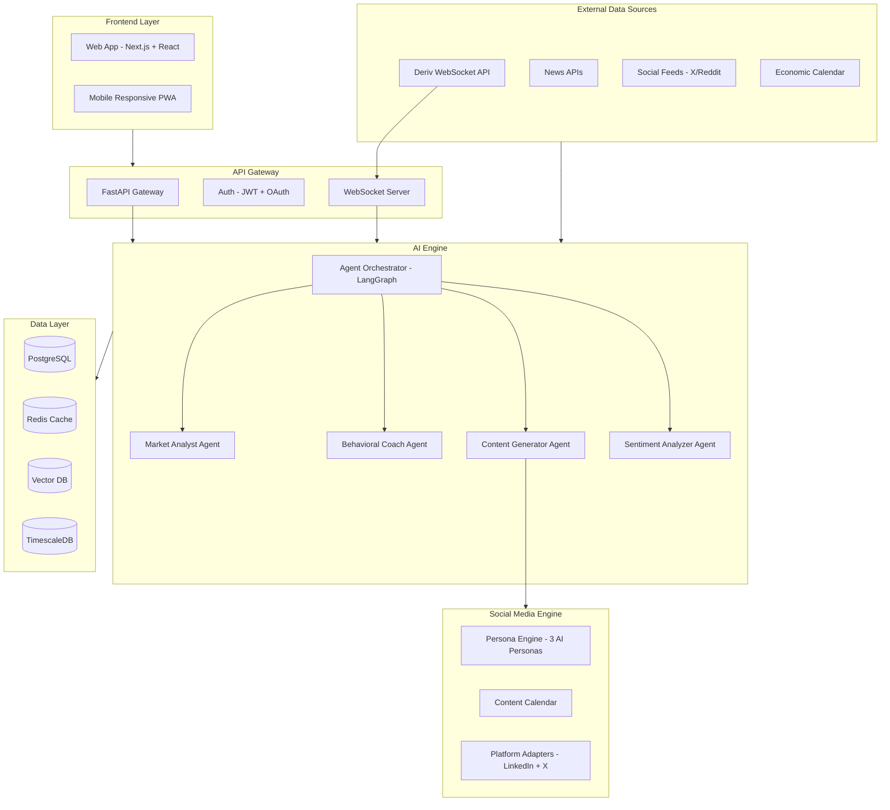
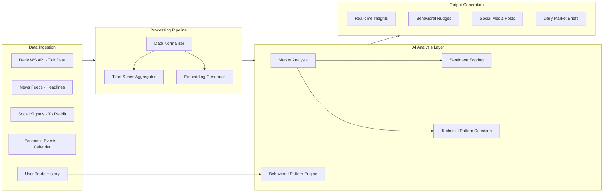
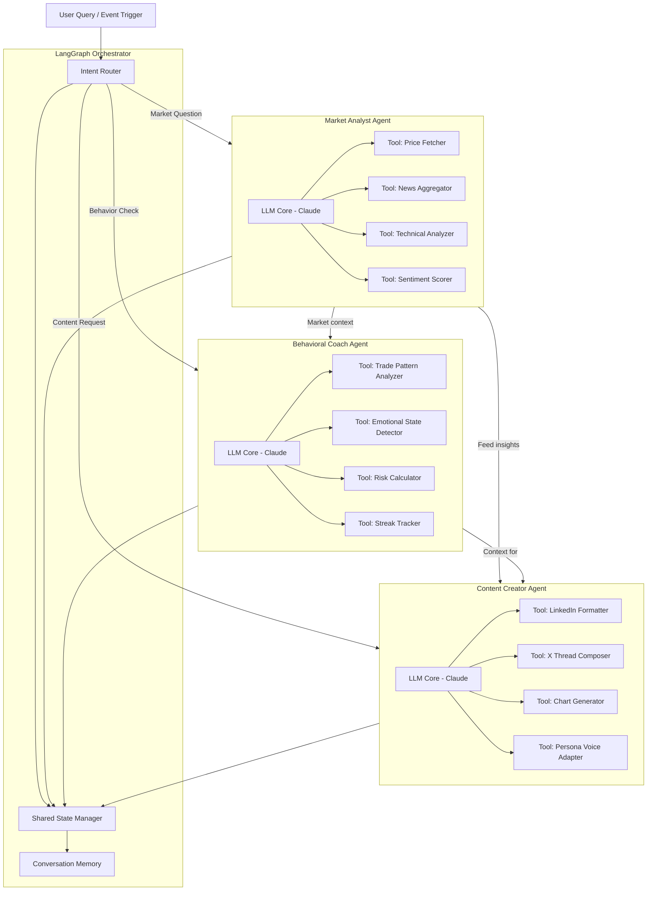
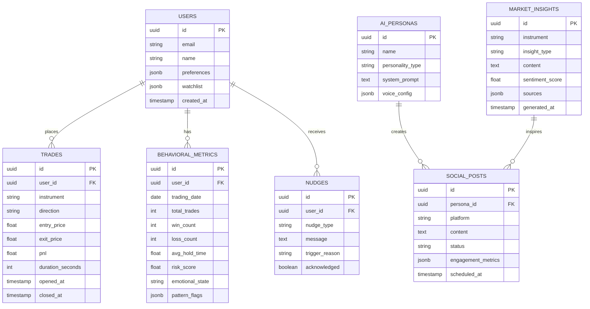
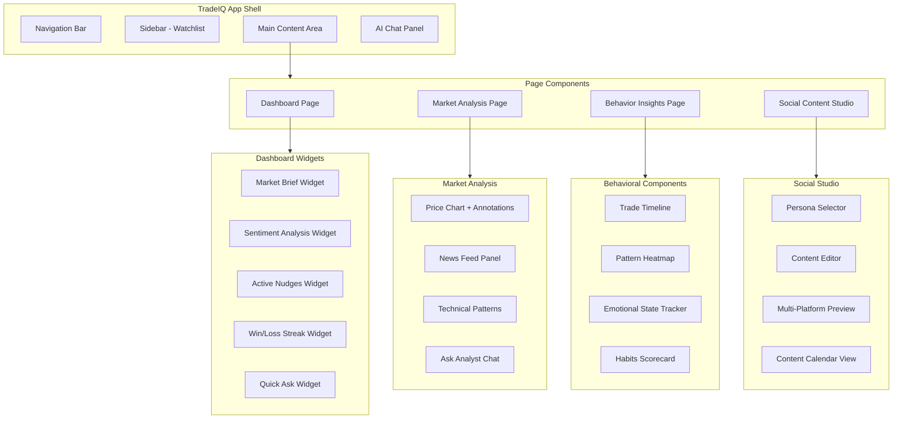
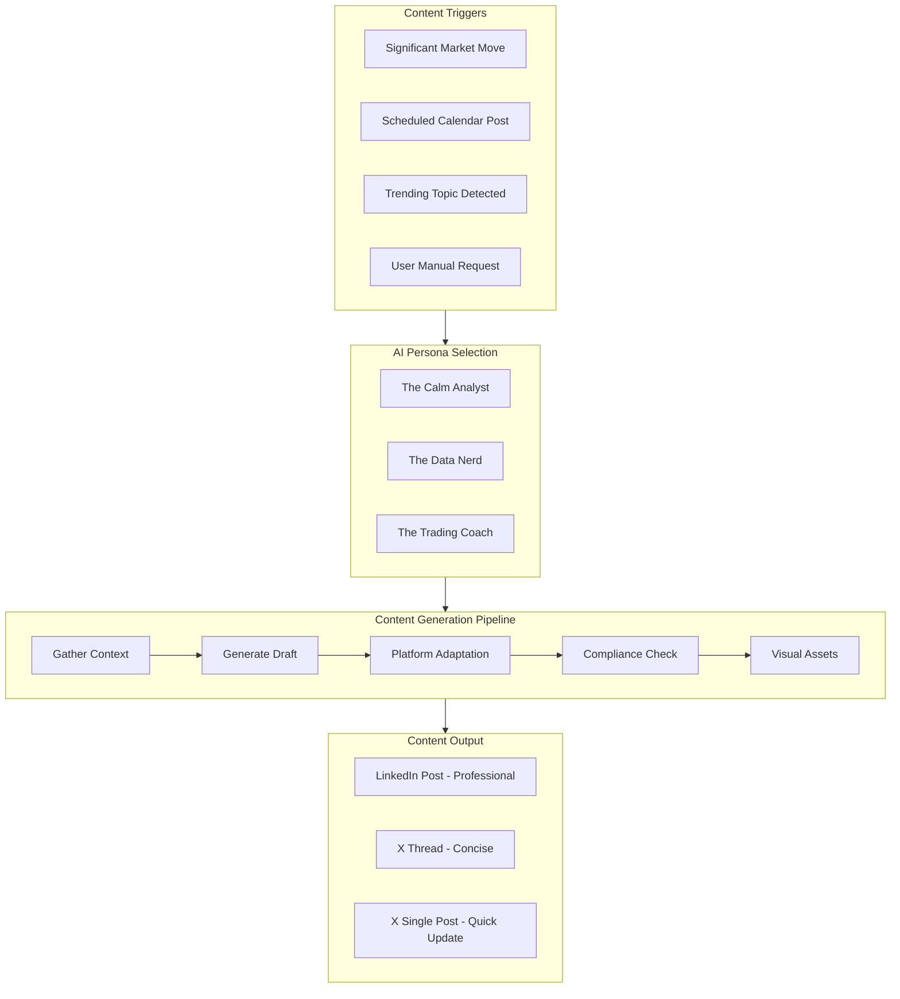
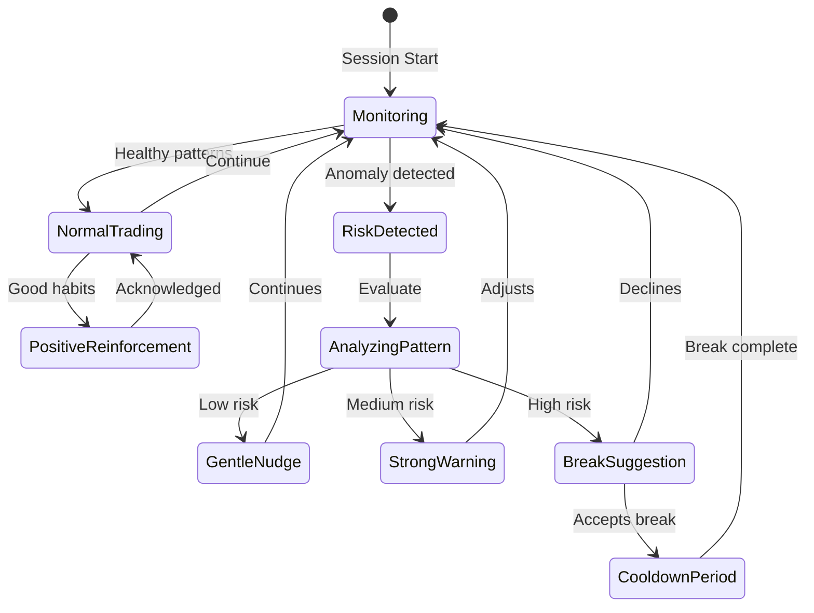
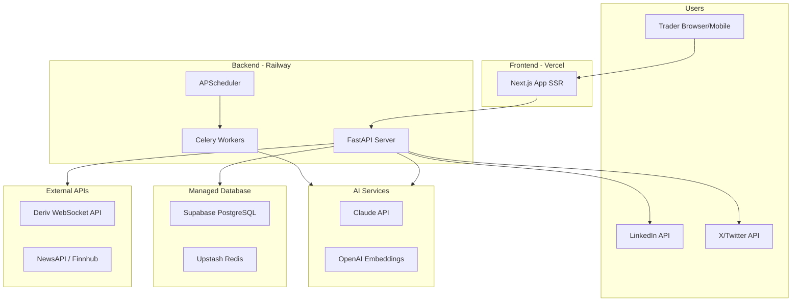
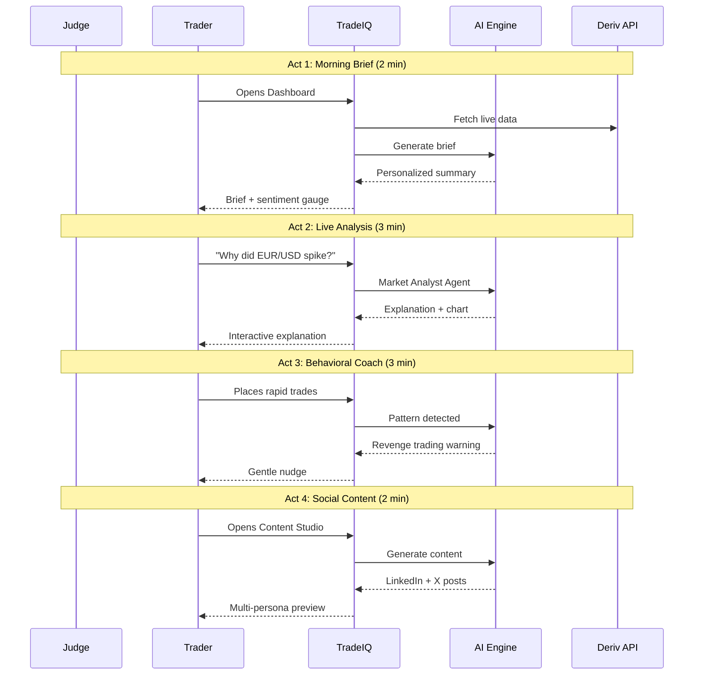

# TradeIQ - Intelligent Trading Analyst
## Deriv AI Hackathon 2026 - Comprehensive Design Document

---

## 1. Product Vision

**TradeIQ** is an AI-powered trading intelligence platform that combines three interconnected pillars:
1. **Market Analysis** - Real-time market explanations and insights
2. **Behavioral Coaching** - Pattern detection and sustainable trading habits
3. **Social Content Engine** - AI personas that generate engaging trading content

> "The Bloomberg Terminal for retail traders, the trading coach they never had, and the content team they always wanted."

### Alignment with Deriv's Mission
Deriv makes trading **accessible**. TradeIQ makes trading **intelligent**. We bridge the gap between platform access and trading intelligence that was previously only available to professionals.

---

## 2. Evaluation Criteria Alignment

| Criterion | Weight | Our Strategy |
|-----------|--------|-------------|
| **Insight** | 30% | Multi-source market analysis + behavioral pattern detection + cross-referencing market events with personal trading patterns |
| **Usefulness** | 25% | Daily market briefs, real-time explanations, gentle nudges (not preachy), habit celebration |
| **Craft** | 20% | Clean Next.js UI, conversational AI chat, real-time WebSocket updates, polished persona system |
| **Ambition** | 15% | Three AI agents working together, the "wow moment" where market + behavior + content intersect |
| **Demo** | 10% | 4-act story structure: Morning Brief -> Live Analysis -> Behavioral Coaching -> Social Magic |

---

## 3. System Architecture

### High-Level Architecture



### Key Architecture Decisions

| Decision | Choice | Rationale |
|----------|--------|-----------|
| Frontend | Next.js 14 + React | SSR for SEO, App Router, fast prototyping with shadcn/ui |
| Backend | FastAPI (Python) | Async, fast, great AI/ML ecosystem, WebSocket support |
| AI Orchestration | LangGraph | Stateful multi-agent workflows, tool calling, better than raw chains |
| Primary LLM | Claude API | Superior reasoning for market analysis, nuanced behavioral coaching |
| Database | Supabase (PostgreSQL) | Free tier, built-in auth, realtime subscriptions, instant setup |
| Cache | Upstash Redis | Serverless, free tier, rate limiting |
| Deployment | Vercel + Railway | Fast deploy, free tiers, WebSocket support |

---

## 4. Data Flow Architecture



### Data Sources & APIs

| Source | API | Data Type | Update Frequency |
|--------|-----|-----------|-----------------|
| **Deriv** | WebSocket API (`api.deriv.com`) | Tick data, candles, trade history | Real-time |
| **News** | NewsAPI / Finnhub | Headlines, articles | Every 5 min |
| **Sentiment** | X API / Reddit API | Social mentions, sentiment | Every 15 min |
| **Economic** | ForexFactory / Trading Economics | Calendar events, indicators | Daily |

---

## 5. AI Agent Architecture

### Multi-Agent System Design



### Agent Specifications

#### Market Analyst Agent
- **System Prompt Core**: "You are a calm, professional market analyst. Explain market movements clearly without predictions or buy/sell signals. Reference data sources. Use plain language."
- **Tools**:
  - `fetch_price_data(instrument, timeframe)` - Deriv API
  - `search_news(instrument, hours=24)` - NewsAPI
  - `analyze_technicals(instrument)` - Pattern recognition
  - `get_sentiment(instrument)` - Multi-source NLP

#### Behavioral Coach Agent
- **System Prompt Core**: "You are a supportive trading coach. Never preachy or condescending. Detect patterns, give gentle nudges. Celebrate good habits. Focus on sustainability, not just profits."
- **Detection Patterns**:
  - Revenge Trading: 3+ trades within 10 min after a loss
  - Overtrading: Trade frequency 2x above daily average
  - Loss Chasing: Increasing position sizes after consecutive losses
  - Tilt Detection: Sudden change in hold time (too short or too long)
  - Time-based: Trading during historically poor performance hours

#### Content Creator Agent
- **System Prompt Core**: "You generate engaging trading content. Never predictions. Always educational. Adapt voice to the persona being used."
- **Three Personas**:

| Persona | Voice | Platform Focus | Example Style |
|---------|-------|---------------|---------------|
| **The Calm Analyst** | Measured, data-driven, reassuring | LinkedIn | "EUR/USD moved 1.2% today. Here's what the data tells us..." |
| **The Data Nerd** | Technical, chart-heavy, geeky | X Threads | "Thread: 5 charts that explain today's market in 60 seconds" |
| **The Trading Coach** | Warm, encouraging, educational | Both | "Hot take: The best trade today was the one you didn't take" |

---

## 6. Database Schema



---

## 7. Frontend Component Architecture



### UI/UX Design Principles

1. **Dashboard-first**: Morning market brief front and center
2. **Chat-centric**: Persistent AI chat panel for "Why did X happen?"
3. **Non-intrusive nudges**: Toast notifications, not modal popups
4. **Dark mode default**: Traders prefer dark UIs
5. **Data density**: Show rich info without overwhelming
6. **Split view**: Market analysis left, AI explanation right

### Key Screens

| Screen | Purpose | Key Components |
|--------|---------|---------------|
| **Dashboard** | Daily starting point | Market brief, sentiment gauge, nudges, streak tracker |
| **Market Analysis** | Deep-dive into instruments | Price chart, news feed, technical patterns, AI Q&A |
| **Behavior Insights** | Trading psychology review | Trade timeline, pattern heatmap, habit scorecard |
| **Content Studio** | Social media management | Persona selector, multi-platform preview, calendar |

---

## 8. Social Media Content Engine



### Content Types

| Type | Platform | Format | Frequency |
|------|----------|--------|-----------|
| Morning Market Brief | LinkedIn + X | Long-form + Thread | Daily 8 AM |
| Market Move Alert | X | Single tweet + chart | Real-time |
| Weekly Wrap-up | LinkedIn | Article-style | Weekly Friday |
| Educational Thread | X | 5-10 tweet thread | 3x/week |
| Trading Psychology Tip | Both | Short insight | Daily |

### Compliance Rules (Automated)
- No price predictions or buy/sell signals
- Disclaimer footer on all posts
- No specific financial advice
- No client data exposure
- Brand-safe language filter
- Factual accuracy cross-check

---

## 9. Behavioral Pattern Detection



### Detection Algorithms

| Pattern | Detection Logic | Nudge Type |
|---------|----------------|------------|
| **Revenge Trading** | 3+ trades within 10 min after loss | Gentle: "Take a breath. Markets will still be here." |
| **Overtrading** | Trade count > 2x daily average | Moderate: "You've traded more than usual today." |
| **Loss Chasing** | Position size increasing after losses | Strong: "Your sizes are growing. Let's review." |
| **Win Streak Overconfidence** | Risk increases after 5+ wins | Gentle: "Great streak! Stay disciplined." |
| **Emotional Trading Hours** | Trades during personal poor-performance times | Moderate: "Historically, your 2-4 PM trades underperform." |

### The "Wow Moment" Integration
> "EUR/USD just dropped 1.5% on ECB news. Based on your history, you tend to chase moves like this and your win rate drops to 20% in these situations. Instead of trading now, here's an insight you could share with your network."

This combines all three pillars: market context + behavioral awareness + content generation.

---

## 10. Deployment Architecture



### Infrastructure Costs (Hackathon Demo)

| Service | Tier | Cost |
|---------|------|------|
| Vercel | Hobby | Free |
| Railway | Starter | Free ($5 credit) |
| Supabase | Free | Free |
| Upstash Redis | Free | Free |
| Claude API | Pay-per-use | ~$5-10 for demo |
| NewsAPI | Developer | Free |
| Deriv API | Free | Free |

---

## 11. Demo Script - Live Presentation



### Demo Narrative Structure (10 min)

**Opening (30s):** "Meet Alex. Like millions of retail traders, Alex has access to markets but not intelligence."

**Act 1 - Morning Brief (2 min):**
- Show the dashboard with live market data
- AI-generated personalized brief for Alex's watchlist
- Sentiment analysis across instruments

**Act 2 - Real-time Analysis (3 min):**
- Live market move happens (or simulated)
- Ask: "Why did EUR/USD just spike?"
- Show AI's multi-source explanation with chart annotations
- Demonstrate technical pattern recognition

**Act 3 - Behavioral Coaching (3 min):**
- Show Alex placing several quick trades (simulated)
- System detects revenge trading pattern
- Gentle nudge appears: "You've made 4 trades in 8 minutes after a loss. Your win rate drops to 15% in these situations."
- Show behavioral dashboard: pattern heatmap, habit score

**Act 4 - Social Content Magic (2 min):**
- Click "Turn this insight into content"
- Show 3 persona versions of the same market insight
- Preview LinkedIn post vs X thread
- Schedule to content calendar

**Wow Moment (30s):**
- "The market just did X, and based on your history, you tend to Y. Here's a better use of this moment - share your knowledge instead."

---

## 12. Tech Stack Summary

### Frontend
```
Next.js 14 (App Router)
React 18
TypeScript
Tailwind CSS + shadcn/ui
Recharts (data visualization)
TradingView Lightweight Charts
Socket.io Client (real-time)
```

### Backend
```
Python 3.11+
FastAPI (async API + WebSocket)
LangGraph (agent orchestration)
LangChain (tool framework)
Celery + Redis (background tasks)
APScheduler (content calendar)
```

### AI/ML
```
Claude API (primary LLM)
OpenAI Embeddings (vector search)
NLTK/TextBlob (sentiment)
TA-Lib (technical analysis)
```

### Infrastructure
```
Vercel (frontend hosting)
Railway (backend hosting)
Supabase (PostgreSQL + Auth)
Upstash (Redis)
```

---

## 13. Project Structure

```
tradeiq/
├── frontend/                    # Next.js App
│   ├── app/
│   │   ├── page.tsx            # Dashboard
│   │   ├── market/page.tsx     # Market Analysis
│   │   ├── behavior/page.tsx   # Behavioral Insights
│   │   ├── content/page.tsx    # Social Content Studio
│   │   └── api/                # API routes (BFF)
│   ├── components/
│   │   ├── dashboard/          # Dashboard widgets
│   │   ├── market/             # Market analysis components
│   │   ├── behavior/           # Behavioral components
│   │   ├── content/            # Social content components
│   │   ├── chat/               # AI chat panel
│   │   └── ui/                 # shadcn/ui components
│   └── lib/
│       ├── hooks/              # Custom React hooks
│       ├── api.ts              # API client
│       └── websocket.ts        # WebSocket client
│
├── backend/                     # FastAPI Server
│   ├── app/
│   │   ├── main.py             # FastAPI app
│   │   ├── routers/
│   │   │   ├── market.py       # Market endpoints
│   │   │   ├── behavior.py     # Behavior endpoints
│   │   │   ├── content.py      # Content endpoints
│   │   │   └── websocket.py    # WS handler
│   │   ├── agents/
│   │   │   ├── orchestrator.py # LangGraph orchestrator
│   │   │   ├── market_analyst.py
│   │   │   ├── behavior_coach.py
│   │   │   └── content_creator.py
│   │   ├── tools/
│   │   │   ├── deriv_api.py    # Deriv WS client
│   │   │   ├── news_fetcher.py
│   │   │   ├── sentiment.py
│   │   │   └── technicals.py
│   │   ├── models/
│   │   │   ├── user.py
│   │   │   ├── trade.py
│   │   │   └── content.py
│   │   └── services/
│   │       ├── behavioral.py   # Pattern detection
│   │       ├── personas.py     # AI persona management
│   │       └── scheduler.py    # Content calendar
│   └── requirements.txt
│
└── docs/
    └── DESIGN_DOCUMENT.md      # This file
```

---

## 14. Risk Mitigation

| Risk | Mitigation |
|------|-----------|
| LLM latency for real-time | Cache common queries, stream responses, pre-generate market briefs |
| Deriv API rate limits | Redis caching, batch requests, fallback to cached data |
| Content quality control | Compliance filter before publishing, human review queue |
| Demo reliability | Pre-cached responses for demo scenarios, fallback data |
| Scope creep | MVP focus: 1 instrument deep, 1 persona polished, core chat working |

---

## 15. MVP Feature Priority (Hackathon Scope)

### Must Have (Demo Day)
- [ ] Dashboard with live market brief (Deriv API)
- [ ] AI chat: "Why did [instrument] move?"
- [ ] Basic behavioral pattern detection (revenge trading + overtrading)
- [ ] Gentle nudge notification system
- [ ] One AI persona generating LinkedIn + X content
- [ ] Content preview and scheduling UI

### Nice to Have
- [ ] Multiple AI personas with distinct voices
- [ ] Full content calendar with auto-scheduling
- [ ] Sentiment analysis gauge
- [ ] Technical pattern annotations on charts
- [ ] Trade history import from Deriv

### Future Vision
- [ ] Real social media posting via APIs
- [ ] Community features and leaderboards
- [ ] Advanced ML behavioral models
- [ ] Mobile native app
- [ ] Multi-language support

---

## 16. Competitive Advantages

1. **Three-pillar integration** - No existing tool combines market analysis + behavioral coaching + social content generation
2. **Deriv-native** - Built specifically for Deriv's ecosystem and API
3. **Supportive, not restrictive** - Advises without blocking trades
4. **Social content engine** - Turns insights into community-building content
5. **The "Wow Moment"** - Cross-referencing market events with personal behavior patterns to generate personalized shareable content

---

*Document Version: 1.0*
*Last Updated: February 7, 2026*
*Team: Group 75*
