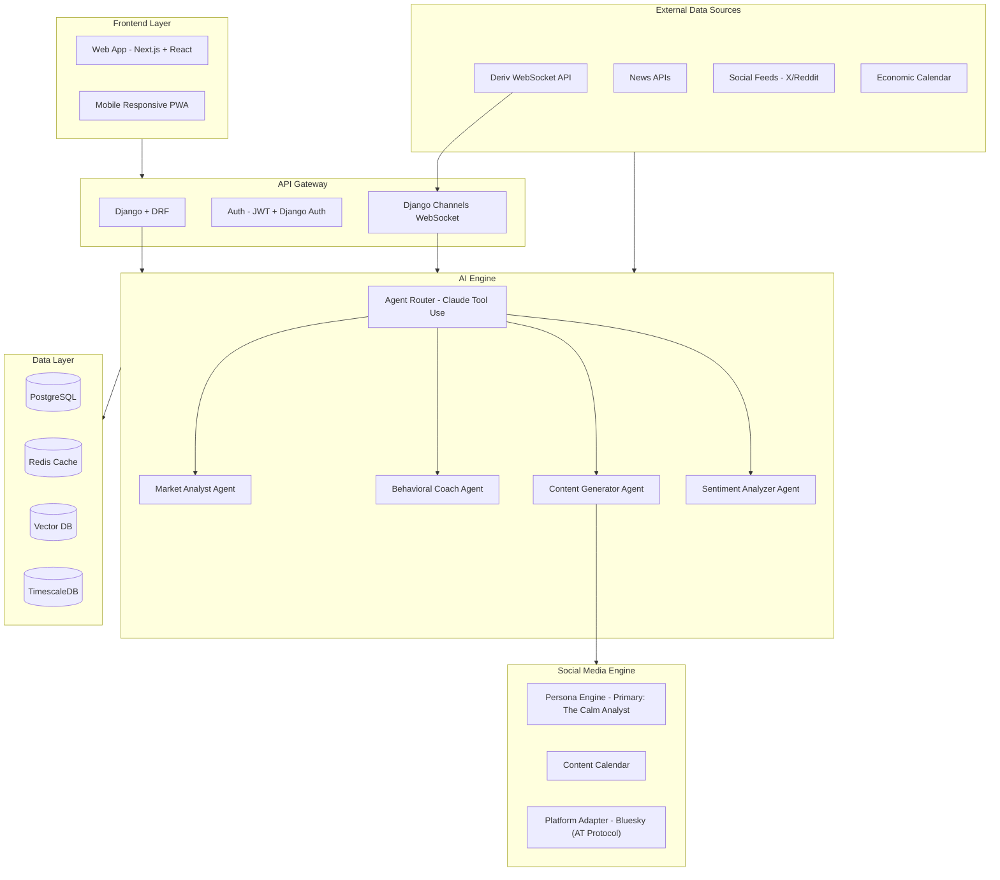
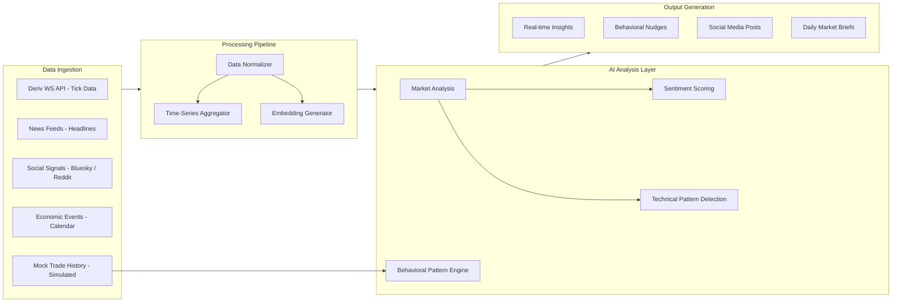
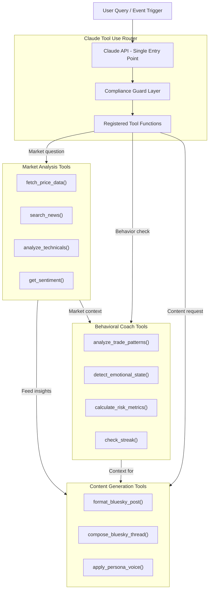
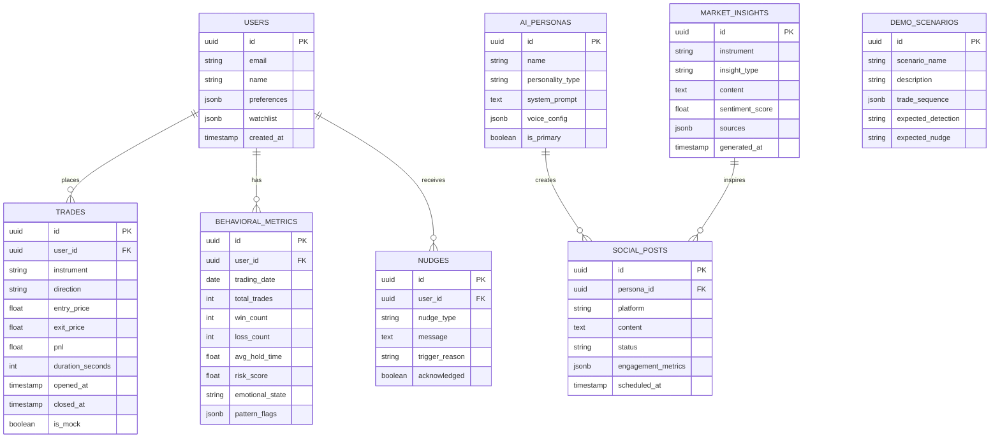
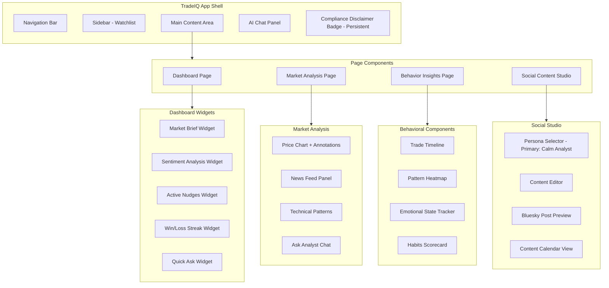
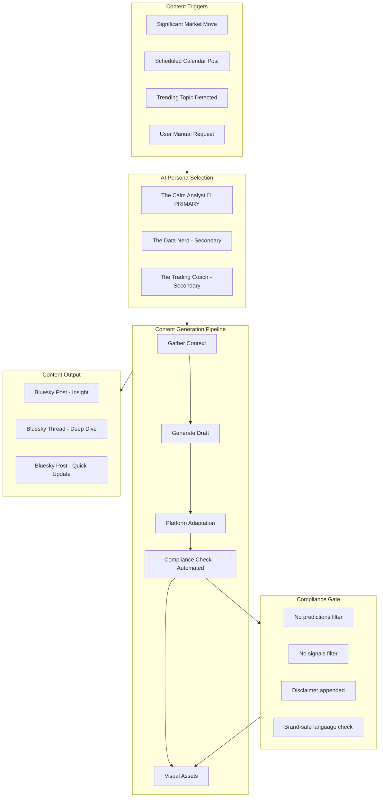
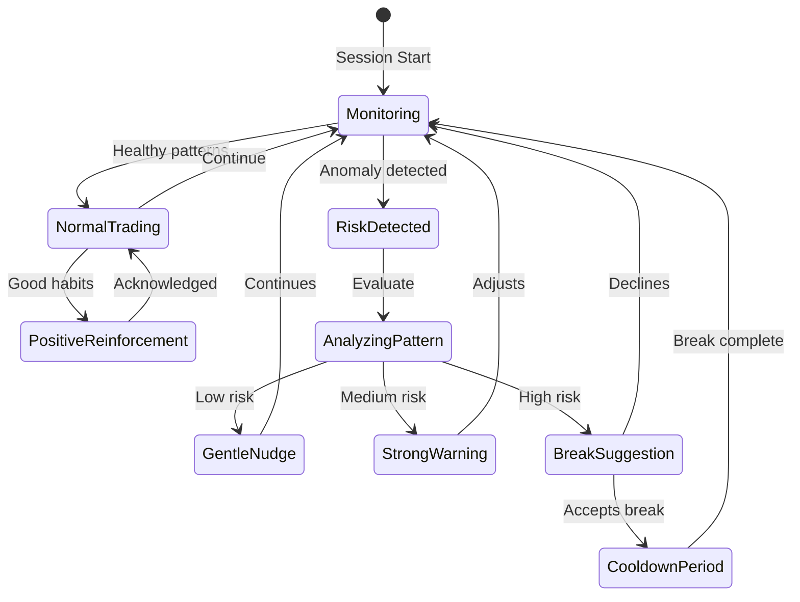
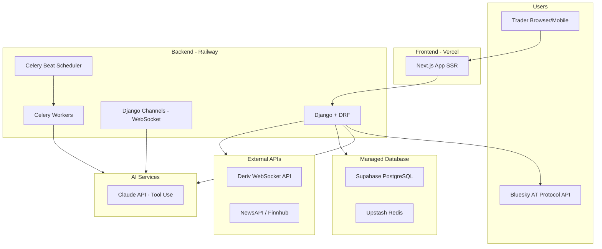
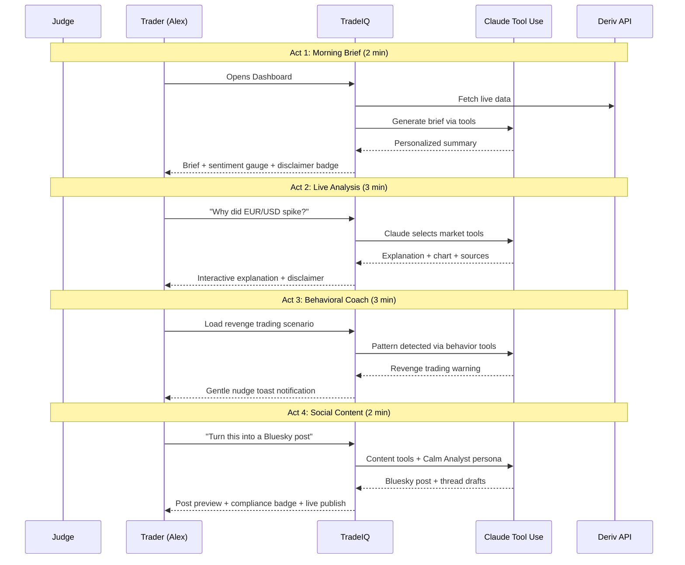

# TradeIQ - Intelligent Trading Analyst
## Deriv AI Hackathon 2026 - Comprehensive Design Document

---

## 1. Product Vision

**TradeIQ** is an AI-powered trading intelligence platform that combines three interconnected pillars:
1. **Market Analysis** - Real-time market explanations and insights
2. **Behavioral Coaching** - Pattern detection and sustainable trading habits
3. **Social Content Engine** - AI personas that generate engaging trading content

> "The Bloomberg Terminal for retail traders, the trading coach they never had, and the content team they always wanted."

### Alignment with Deriv's Mission
Deriv makes trading **accessible**. TradeIQ makes trading **intelligent**. We bridge the gap between platform access and trading intelligence that was previously only available to professionals.

---

## 2. Evaluation Criteria Alignment

| Criterion | Weight | Our Strategy |
|-----------|--------|-------------|
| **Insight** | 30% | Multi-source market analysis + behavioral pattern detection + cross-referencing market events with personal trading patterns |
| **Usefulness** | 25% | Daily market briefs, real-time explanations, gentle nudges (not preachy), habit celebration |
| **Craft** | 20% | Clean Next.js UI, conversational AI chat, real-time WebSocket updates, polished persona system |
| **Ambition** | 15% | Three AI agents working together, the "wow moment" where market + behavior + content intersect |
| **Demo** | 10% | 4-act story structure: Morning Brief -> Live Analysis -> Behavioral Coaching -> Social Magic |

---

## 3. System Architecture

### High-Level Architecture



### Key Architecture Decisions

| Decision | Choice | Rationale |
|----------|--------|-----------|
| Frontend | Next.js 14 + React | SSR for SEO, App Router, fast prototyping with shadcn/ui |
| Backend | Django 5 + DRF + Channels | Mature ecosystem, built-in ORM/admin/auth, Channels for WebSocket, team familiarity |
| AI Orchestration | Claude Tool Use (native) | Lightweight function-call routing via Claude's built-in tool use — no heavy framework overhead, faster to debug than LangGraph, sufficient for hackathon scope |
| Primary LLM | Claude API | Superior reasoning for market analysis, nuanced behavioral coaching |
| Database | Supabase (PostgreSQL) | Free tier, built-in auth, realtime subscriptions, instant setup |
| Cache | Upstash Redis | Serverless, free tier, rate limiting |
| Deployment | Vercel + Railway | Fast deploy, free tiers, WebSocket support |

> **Why Claude Tool Use over LangGraph?** LangGraph adds multi-agent state machine complexity that increases debugging time significantly during a hackathon. Claude's native tool use provides the same routing capability (market question → market tools, behavior question → behavior tools) with a simple function dispatch pattern. We can always upgrade to LangGraph post-hackathon if needed.

---

## 4. Data Flow Architecture



### Data Sources & APIs

| Source | API | Data Type | Update Frequency |
|--------|-----|-----------|-----------------|
| **Deriv** | WebSocket API (`api.deriv.com`) | Tick data, candles, trade history | Real-time |
| **News** | NewsAPI / Finnhub | Headlines, articles | Every 5 min |
| **Sentiment** | Bluesky AT Protocol / Reddit API | Social mentions, sentiment | Every 15 min |
| **Economic** | ForexFactory / Trading Economics | Calendar events, indicators | Daily |
| **Mock Trades** | Pre-built JSON fixtures | Simulated user trade history | Pre-loaded |

### Mock Data Strategy (Hackathon Demo)

Since we won't have real user trading history during the hackathon, we use **pre-built scenario fixtures** to demonstrate behavioral detection:

| Scenario | Mock Data Description | Demo Purpose |
|----------|----------------------|-------------|
| **Revenge Trading** | 5 trades in 8 min after a -$200 loss, escalating position sizes | Show nudge: "Take a breath" |
| **Overtrading** | 25 trades in one day (vs. 8 avg), decreasing hold times | Show nudge: "You've traded 3x your average" |
| **Loss Chasing** | 4 consecutive losses, each with 1.5x previous size | Show nudge: "Your sizes are growing" |
| **Healthy Session** | 6 trades, 60% win rate, consistent sizing, reasonable hold times | Show positive reinforcement |

Mock data is loaded via Django fixtures (`python manage.py loaddata demo_scenarios`) and can be switched between scenarios during the live demo with a single API call.

---

## 5. AI Agent Architecture

### Simplified Agent Routing via Claude Tool Use



> **How it works:** We register all tools (market, behavior, content) as Claude tool definitions in a single API call. Claude's native tool use decides which tools to invoke based on the user query. A Django service layer dispatches the actual function calls. No LangGraph state machine needed — just clean Python functions behind Claude's routing.

### Tool Registration Example (Django Service)

```python
# backend/agents/tools.py

TOOLS = [
    {
        "name": "fetch_price_data",
        "description": "Fetch live price data for a trading instrument from Deriv API",
        "input_schema": {
            "type": "object",
            "properties": {
                "instrument": {"type": "string", "description": "e.g. EUR/USD, BTC/USD"},
                "timeframe": {"type": "string", "enum": ["1m", "5m", "1h", "1d"]}
            },
            "required": ["instrument"]
        }
    },
    {
        "name": "analyze_trade_patterns",
        "description": "Analyze user's recent trading behavior for emotional or impulsive patterns",
        "input_schema": {
            "type": "object",
            "properties": {
                "user_id": {"type": "string"},
                "lookback_hours": {"type": "integer", "default": 24}
            },
            "required": ["user_id"]
        }
    },
    {
        "name": "generate_social_content",
        "description": "Generate social media content from a market insight using The Calm Analyst persona for Bluesky",
        "input_schema": {
            "type": "object",
            "properties": {
                "insight": {"type": "string"},
                "platform": {"type": "string", "enum": ["bluesky_post", "bluesky_thread"]}
            },
            "required": ["insight", "platform"]
        }
    }
    # ... more tools
]
```

### Agent Specifications

#### Market Analyst Agent
- **System Prompt Core**: See [Compliance-Hardened System Prompts](#compliance-hardened-system-prompts) below.
- **Tools**:
  - `fetch_price_data(instrument, timeframe)` - Deriv API
  - `search_news(instrument, hours=24)` - NewsAPI
  - `analyze_technicals(instrument)` - Pattern recognition
  - `get_sentiment(instrument)` - Multi-source NLP

#### Behavioral Coach Agent
- **System Prompt Core**: See [Compliance-Hardened System Prompts](#compliance-hardened-system-prompts) below.
- **Detection Patterns**:
  - Revenge Trading: 3+ trades within 10 min after a loss
  - Overtrading: Trade frequency 2x above daily average
  - Loss Chasing: Increasing position sizes after consecutive losses
  - Tilt Detection: Sudden change in hold time (too short or too long)
  - Time-based: Trading during historically poor performance hours

#### Content Creator Agent
- **System Prompt Core**: See [Compliance-Hardened System Prompts](#compliance-hardened-system-prompts) below.
- **Persona System**:

| Persona | Voice | Platform Focus | Example Style | Priority |
|---------|-------|---------------|---------------|----------|
| **The Calm Analyst** 🎯 | Measured, data-driven, reassuring | Bluesky | "EUR/USD moved 1.2% today. Here's what the data tells us..." | **PRIMARY — fully polished for demo** |
| **The Data Nerd** | Technical, chart-heavy, geeky | Bluesky Threads | "Thread: 5 charts that explain today's market in 60 seconds" | Secondary — quick switch demo only |
| **The Trading Coach** | Warm, encouraging, educational | Bluesky | "Hot take: The best trade today was the one you didn't take" | Secondary — quick switch demo only |

> **Demo strategy:** We demo The Calm Analyst end-to-end with full voice consistency and quality. The other two personas appear as a "switch persona" dropdown to show range, but The Calm Analyst carries the demo.

---

## 6. Compliance-Hardened System Prompts

All AI outputs pass through a **compliance guard layer** that is hardcoded into every system prompt and reinforced in the Django middleware.

### Master Compliance Rules (Injected into ALL prompts)

```
ABSOLUTE RULES — NEVER VIOLATE:
1. NEVER predict future prices or price direction (e.g., "EUR/USD will rise")
2. NEVER provide buy/sell/hold signals or recommendations
3. NEVER say "you should buy/sell/enter/exit" or any equivalent
4. ALWAYS use past tense or present tense when discussing price movements
5. ALWAYS include educational framing: "historically", "data shows", "analysts note"
6. When discussing patterns, say "this pattern has historically been associated with..."
   NOT "this means the price will..."
7. ALWAYS end substantive market analysis with: "This is analysis, not financial advice."

If a user asks for a prediction or trade signal, respond:
"I'm designed to help you understand what's happening in markets, not to predict
what will happen next. Here's what the data shows about [topic]..."
```

### Per-Agent System Prompts

**Market Analyst:**
```
You are TradeIQ's Calm Market Analyst. You explain market movements clearly
using data, news, and technical context. You are measured, professional,
and reassuring.

{MASTER_COMPLIANCE_RULES}

Your tone: Think Bloomberg anchor, not Reddit trader. Calm, factual, insightful.
You reference specific data points, name news sources, and explain WHY
something happened — never what WILL happen.
```

**Behavioral Coach:**
```
You are TradeIQ's Trading Coach. You help traders recognize their own patterns
and build sustainable habits. You are warm, supportive, and never preachy.

{MASTER_COMPLIANCE_RULES}

Additional rules:
- Never shame a trader for losses
- Frame everything as patterns, not mistakes
- Use "I notice..." not "You're doing X wrong"
- Celebrate consistency, not just profits
- When suggesting a break, make it a gentle question, not a command
```

**Content Creator (The Calm Analyst Persona):**
```
You are "The Calm Analyst", an AI persona that creates engaging trading content
for Bluesky. Your voice is measured, data-driven, and reassuring.

{MASTER_COMPLIANCE_RULES}

Additional content rules:
- Every post must include factual data points
- Bluesky post: concise, under 300 chars, insight-driven
- Bluesky thread: max 5 posts per thread, each under 300 chars
- Never use hype language: "moon", "rocket", "guaranteed", "easy money"
- End every post with: "📊 Analysis by TradeIQ | Not financial advice"
- Brand voice: intelligent, calm, trustworthy — the adult in the room
```

### UI Compliance Badge

Every AI-generated output in the UI displays a small disclaimer badge:

```
┌─────────────────────────────────────────────┐
│  🔍 AI Analysis · Not financial advice      │
│  TradeIQ explains markets — no predictions  │
└─────────────────────────────────────────────┘
```

This badge appears on:
- Every chat response
- Every market brief
- Every generated social media post
- Every behavioral nudge

---

## 7. Database Schema



---

## 8. Frontend Component Architecture



### UI/UX Design Principles

1. **Dashboard-first**: Morning market brief front and center
2. **Chat-centric**: Persistent AI chat panel for "Why did X happen?"
3. **Non-intrusive nudges**: Toast notifications, not modal popups
4. **Dark mode default**: Traders prefer dark UIs
5. **Data density**: Show rich info without overwhelming
6. **Split view**: Market analysis left, AI explanation right
7. **Compliance-visible**: Disclaimer badge on every AI-generated element

### Key Screens

| Screen | Purpose | Key Components |
|--------|---------|---------------|
| **Dashboard** | Daily starting point | Market brief, sentiment gauge, nudges, streak tracker |
| **Market Analysis** | Deep-dive into instruments | Price chart, news feed, technical patterns, AI Q&A |
| **Behavior Insights** | Trading psychology review | Trade timeline, pattern heatmap, habit scorecard |
| **Content Studio** | Social media management | Persona selector (Calm Analyst primary), Bluesky post preview, calendar |

---

## 9. Social Media Content Engine



### Content Types

| Type | Platform | Format | Frequency |
|------|----------|--------|-----------|
| Morning Market Brief | Bluesky | Thread (3-5 posts) | Daily 8 AM |
| Market Move Alert | Bluesky | Single post + chart link | Real-time |
| Weekly Wrap-up | Bluesky | Long thread (5-8 posts) | Weekly Friday |
| Educational Thread | Bluesky | Thread (5-10 posts) | 3x/week |
| Trading Psychology Tip | Bluesky | Single post | Daily |

### Compliance Rules (Automated in Pipeline)
- **Hardcoded in system prompt**: No price predictions or buy/sell signals
- **Post-generation filter**: Regex + LLM check for prediction language
- **Auto-appended disclaimer**: "📊 Analysis by TradeIQ | Not financial advice"
- No client data exposure
- Brand-safe language filter (blocklist: "guaranteed", "moon", "easy money", etc.)
- Factual accuracy cross-check against source data

---

## 10. Behavioral Pattern Detection



### Detection Algorithms

| Pattern | Detection Logic | Nudge Type |
|---------|----------------|------------|
| **Revenge Trading** | 3+ trades within 10 min after loss | Gentle: "Take a breath. Markets will still be here." |
| **Overtrading** | Trade count > 2x daily average | Moderate: "You've traded more than usual today." |
| **Loss Chasing** | Position size increasing after losses | Strong: "Your sizes are growing. Let's review." |
| **Win Streak Overconfidence** | Risk increases after 5+ wins | Gentle: "Great streak! Stay disciplined." |
| **Emotional Trading Hours** | Trades during personal poor-performance times | Moderate: "Historically, your 2-4 PM trades underperform." |

### Demo Data for Behavioral Detection

All behavioral detection is demonstrated using **pre-built mock trade sequences** loaded as Django fixtures:

```python
# backend/fixtures/demo_revenge_trading.json
[
    {"instrument": "EUR/USD", "pnl": -200, "opened_at": "10:00:00", "duration": 300},
    {"instrument": "EUR/USD", "pnl": -150, "opened_at": "10:02:00", "duration": 45},
    {"instrument": "EUR/USD", "pnl": -180, "opened_at": "10:04:00", "duration": 30},
    {"instrument": "GBP/USD", "pnl": -250, "opened_at": "10:05:30", "duration": 20},
    {"instrument": "EUR/USD", "pnl": -300, "opened_at": "10:07:00", "duration": 15}
]
# Pattern: 5 trades in 7 min, decreasing hold times, increasing losses → REVENGE TRADING
```

During the demo, we can switch scenarios via:
```
POST /api/demo/load-scenario/
{"scenario": "revenge_trading"}  # or "overtrading", "loss_chasing", "healthy_session"
```

### The "Wow Moment" Integration
> "EUR/USD just dropped 1.5% on ECB news. Based on your history, you tend to chase moves like this and your win rate drops to 20% in these situations. Instead of trading now, here's an insight you could share with your network."

This combines all three pillars: market context + behavioral awareness + content generation.

---

## 11. Deployment Architecture



### Infrastructure Costs (Hackathon Demo)

| Service | Tier | Cost |
|---------|------|------|
| Vercel | Hobby | Free |
| Railway | Starter | Free ($5 credit) |
| Supabase | Free | Free |
| Upstash Redis | Free | Free |
| Claude API | Pay-per-use | ~$5-10 for demo |
| NewsAPI | Developer | Free |
| Deriv API | Free | Free |
| Bluesky API | Free (AT Protocol) | Free |

---

## 12. Demo Script - Live Presentation



### Demo Narrative Structure (10 min)

**Opening (30s):** "Meet Alex. Like millions of retail traders, Alex has access to markets but not intelligence."

**Act 1 - Morning Brief (2 min):**
- Show the dashboard with live market data
- AI-generated personalized brief for Alex's watchlist
- Sentiment analysis across instruments
- Point out: disclaimer badge visible on all AI content

**Act 2 - Real-time Analysis (3 min):**
- Live market move happens (or simulated with cached data)
- Ask: "Why did EUR/USD just spike?"
- Show AI's multi-source explanation with chart annotations
- Demonstrate: AI explains what happened, never predicts what will happen

**Act 3 - Behavioral Coaching (3 min):**
- Load revenge trading mock scenario
- System detects pattern from mock trade history
- Gentle nudge appears: "You've made 4 trades in 8 minutes after a loss. Your win rate drops to 15% in these situations."
- Show behavioral dashboard: pattern heatmap, habit score

**Act 4 - Social Content Magic (2 min):**
- Click "Turn this insight into content"
- Show The Calm Analyst persona generating a Bluesky post
- Quick switch to Data Nerd and Trading Coach to show range
- Preview compliance badge auto-appended to all posts
- **Live publish to Bluesky** — show the post appearing on the real platform
- Schedule thread to content calendar

**Wow Moment (30s):**
- "The market just did X, and based on your history, you tend to Y. Here's a better use of this moment — share your knowledge instead."

---

## 13. Tech Stack Summary

### Frontend
```
Next.js 14 (App Router)
React 18
TypeScript
Tailwind CSS + shadcn/ui
Recharts (data visualization)
TradingView Lightweight Charts
Socket.io Client (real-time)
```

### Backend
```
Python 3.11+
Django 5.0 + Django REST Framework
Django Channels (WebSocket support)
Celery + Redis (background tasks)
Celery Beat (content calendar scheduling)
Anthropic Python SDK (Claude Tool Use)
atproto Python SDK (Bluesky publishing)
```

### AI/ML
```
Claude API with Tool Use (primary LLM + routing)
NLTK/TextBlob (sentiment fallback)
TA-Lib (technical analysis)
```

### Infrastructure
```
Vercel (frontend hosting)
Railway (backend hosting)
Supabase (PostgreSQL + Auth)
Upstash (Redis)
```

---

## 14. Project Structure

```
tradeiq/
├── frontend/                    # Next.js App
│   ├── app/
│   │   ├── page.tsx            # Dashboard
│   │   ├── market/page.tsx     # Market Analysis
│   │   ├── behavior/page.tsx   # Behavioral Insights
│   │   ├── content/page.tsx    # Social Content Studio
│   │   └── api/                # API routes (BFF)
│   ├── components/
│   │   ├── dashboard/          # Dashboard widgets
│   │   ├── market/             # Market analysis components
│   │   ├── behavior/           # Behavioral components
│   │   ├── content/            # Social content components
│   │   ├── chat/               # AI chat panel
│   │   ├── compliance/         # Disclaimer badge component
│   │   └── ui/                 # shadcn/ui components
│   └── lib/
│       ├── hooks/              # Custom React hooks
│       ├── api.ts              # API client
│       └── websocket.ts        # WebSocket client
│
├── backend/                     # Django Project
│   ├── manage.py
│   ├── tradeiq/                # Django project settings
│   │   ├── settings.py
│   │   ├── urls.py
│   │   ├── asgi.py             # ASGI config for Channels
│   │   └── celery.py           # Celery config
│   ├── market/                 # Market analysis app
│   │   ├── models.py
│   │   ├── views.py            # DRF ViewSets
│   │   ├── serializers.py
│   │   ├── urls.py
│   │   └── tools.py            # Claude tool functions for market
│   ├── behavior/               # Behavioral coaching app
│   │   ├── models.py
│   │   ├── views.py
│   │   ├── serializers.py
│   │   ├── urls.py
│   │   ├── tools.py            # Claude tool functions for behavior
│   │   └── detection.py        # Pattern detection algorithms
│   ├── content/                # Social content app
│   │   ├── models.py
│   │   ├── views.py
│   │   ├── serializers.py
│   │   ├── urls.py
│   │   ├── tools.py            # Claude tool functions for content
│   │   ├── personas.py         # Persona voice configs
│   │   └── bluesky.py          # Bluesky AT Protocol client (post + thread)
│   ├── agents/                 # AI agent layer
│   │   ├── router.py           # Claude Tool Use dispatcher
│   │   ├── prompts.py          # All system prompts + compliance rules
│   │   ├── tools_registry.py   # Tool definitions for Claude API
│   │   └── compliance.py       # Post-generation compliance filter
│   ├── chat/                   # Django Channels WebSocket
│   │   ├── consumers.py        # WS consumer
│   │   └── routing.py          # WS URL routing
│   ├── demo/                   # Demo utilities
│   │   ├── views.py            # Scenario switching endpoint
│   │   └── urls.py
│   ├── fixtures/               # Mock data for demo
│   │   ├── demo_revenge_trading.json
│   │   ├── demo_overtrading.json
│   │   ├── demo_loss_chasing.json
│   │   ├── demo_healthy_session.json
│   │   └── demo_personas.json
│   └── requirements.txt
│
└── docs/
    └── DESIGN_DOCUMENT.md      # This file
```

---

## 15. Risk Mitigation

| Risk | Mitigation |
|------|-----------|
| LLM latency for real-time | Cache common queries, stream responses, pre-generate market briefs |
| Deriv API rate limits | Redis caching, batch requests, fallback to cached data |
| Content compliance violation | Hardcoded compliance rules in all system prompts + post-generation filter + UI disclaimer badge |
| No real user trade data | Pre-built mock scenario fixtures with Django loaddata, switchable during demo |
| AI routing complexity | Use Claude native tool use instead of LangGraph — simpler to debug, no state machine overhead |
| Demo reliability | Pre-cached responses for demo scenarios, fallback data, scenario switching API |
| Scope creep | MVP focus: 1 instrument deep, 1 persona polished (The Calm Analyst), core chat working |

---

## 16. MVP Feature Priority (Hackathon Scope)

### 🔴 Must Have (Demo Day) — The Critical 3

- [ ] **AI Chat**: Ask "Why did EUR/USD move?" → get multi-source explanation with chart context
- [ ] **Revenge Trading Detection**: Load mock scenario → system detects pattern → gentle nudge appears
- [ ] **One-Click Social Content**: Turn any market insight into a Bluesky post via The Calm Analyst persona, with **live publish to Bluesky**

> **If we can only demo ONE flow end-to-end, it's this:**
> Market event → AI explains it → detects user would typically revenge trade → nudges user → offers to turn the insight into shareable content instead.

### 🟡 Should Have (If time allows)

- [ ] Dashboard with live market brief (Deriv API)
- [ ] Overtrading + loss chasing detection scenarios
- [ ] Content calendar scheduling UI
- [ ] Sentiment analysis gauge widget

### 🟢 Nice to Have

- [ ] Data Nerd and Trading Coach persona polish
- [ ] Technical pattern annotations on charts
- [ ] Full behavioral heatmap visualization
- [ ] Trade history import from Deriv

### 🔵 Future Vision
- [ ] Expand to X/Twitter and LinkedIn when API approvals are secured
- [ ] Community features and leaderboards
- [ ] Advanced ML behavioral models
- [ ] Mobile native app
- [ ] Multi-language support

---

## 17. Competitive Advantages

1. **Three-pillar integration** - No existing tool combines market analysis + behavioral coaching + social content generation
2. **Deriv-native** - Built specifically for Deriv's ecosystem and API
3. **Supportive, not restrictive** - Advises without blocking trades
4. **Compliance-first** - Hardcoded rules, not afterthought disclaimers
5. **Social content engine** - Turns insights into community-building content via The Calm Analyst persona, with live Bluesky publishing
6. **The "Wow Moment"** - Cross-referencing market events with personal behavior patterns to generate personalized shareable content
7. **Demo-proof** - Mock data strategy ensures reliable, repeatable demonstrations

---

## Appendix A: Key Changes from v1

| Area | v1 | v2 | Rationale |
|------|----|----|-----------|
| Backend | FastAPI | Django 5 + DRF + Channels | Team familiarity, built-in ORM/admin, mature ecosystem |
| AI Orchestration | LangGraph state machine | Claude native Tool Use | Simpler to debug, less overhead, sufficient for hackathon |
| Personas | 3 equally weighted | 1 primary (Calm Analyst) + 2 secondary | Focus on quality over quantity for demo |
| Behavioral data | Assumed real user data | Pre-built mock scenarios with Django fixtures | Realistic for hackathon, reliable for demo |
| Compliance | Mentioned as constraint | Hardcoded in all system prompts + UI badge | Can't risk violating "no predictions" rule in live demo |
| MVP scope | 6 Must Haves | 3 Must Haves (Critical Path) | Ruthless prioritization for hackathon timeline |
| Social platform | X/Twitter + LinkedIn | **Bluesky (AT Protocol)** | No API approval needed, instant setup, live posting in demo |

---

## Appendix B: Bluesky Integration Guide

### Why Bluesky?

| Concern | X/Twitter + LinkedIn | Bluesky |
|---------|---------------------|---------|
| API Approval | Days to weeks | **Instant — no approval needed** |
| Cost | Paid tiers for posting | **Free** |
| Auth | Complex OAuth flows | **App Password — 3 lines of code** |
| Live demo | Can't post without approval | **Live publish during demo** |
| Trading community | Large but noisy | Growing, tech-savvy early adopters |

### Setup (5 minutes)

1. Create a Bluesky account at https://bsky.app
2. Go to **Settings → App Passwords → Add App Password**
3. Save the generated password — this is your API credential

```
# .env
BLUESKY_HANDLE=tradeiq-analyst.bsky.social
BLUESKY_APP_PASSWORD=xxxx-xxxx-xxxx-xxxx
```

### Django Integration

```python
# backend/content/bluesky.py

from atproto import Client
from django.conf import settings

class BlueskyPublisher:
    """Publish trading content to Bluesky via AT Protocol."""

    def __init__(self):
        self.client = Client()
        self.client.login(
            settings.BLUESKY_HANDLE,
            settings.BLUESKY_APP_PASSWORD
        )

    def post(self, text: str) -> dict:
        """Publish a single post (max 300 chars)."""
        response = self.client.send_post(text=text)
        return {
            "uri": response.uri,
            "cid": response.cid,
            "url": self._uri_to_url(response.uri)
        }

    def post_thread(self, posts: list[str]) -> list[dict]:
        """Publish a thread (list of posts, each max 300 chars)."""
        results = []
        parent = None
        root = None

        for i, text in enumerate(posts):
            if parent is None:
                # First post in thread
                response = self.client.send_post(text=text)
                root = {"uri": response.uri, "cid": response.cid}
                parent = root
            else:
                # Reply to previous post
                response = self.client.send_post(
                    text=text,
                    reply_to={
                        "root": root,
                        "parent": parent
                    }
                )
                parent = {"uri": response.uri, "cid": response.cid}

            results.append({
                "index": i,
                "uri": response.uri,
                "cid": response.cid,
                "url": self._uri_to_url(response.uri)
            })

        return results

    def _uri_to_url(self, uri: str) -> str:
        """Convert AT URI to web URL."""
        # at://did:plc:xxx/app.bsky.feed.post/yyy
        parts = uri.replace("at://", "").split("/")
        did = parts[0]
        post_id = parts[-1]
        return f"https://bsky.app/profile/{did}/post/{post_id}"
```

### Django View for Content Publishing

```python
# backend/content/views.py

from rest_framework.views import APIView
from rest_framework.response import Response
from .bluesky import BlueskyPublisher

class PublishToBlueskyView(APIView):
    def post(self, request):
        content = request.data.get("content")
        post_type = request.data.get("type", "single")  # "single" or "thread"

        publisher = BlueskyPublisher()

        if post_type == "thread":
            # content is a list of strings
            results = publisher.post_thread(content)
        else:
            # content is a single string
            results = publisher.post(content)

        return Response({
            "status": "published",
            "platform": "bluesky",
            "results": results
        })
```

### Bluesky Character Limits & Content Rules

| Feature | Limit |
|---------|-------|
| Post length | 300 characters (graphemes) |
| Thread length | Unlimited posts (we cap at 10) |
| Images | 4 per post, max 1MB each |
| Alt text | 2000 characters |
| Links | Auto-detected, no URL shortening needed |
| Rate limit | Reasonable — no strict published limit for normal use |

### Demo "Wow Moment" with Bluesky

During the demo, we **live-publish** to Bluesky in real time:

1. AI generates a market insight
2. The Calm Analyst persona formats it for Bluesky
3. Compliance check auto-runs
4. User clicks "Publish to Bluesky"
5. Post appears on the real Bluesky platform — judges can open the URL and see it live

This is a **massive demo advantage** over teams using X/LinkedIn who can only show mock previews.

---

*Document Version: 3.0*
*Last Updated: February 7, 2026*
*Team: Group 75*
